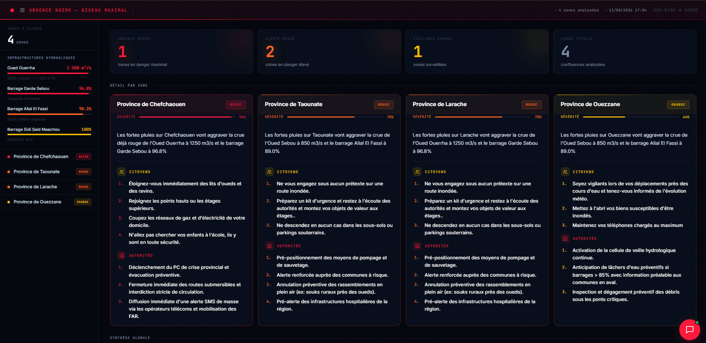
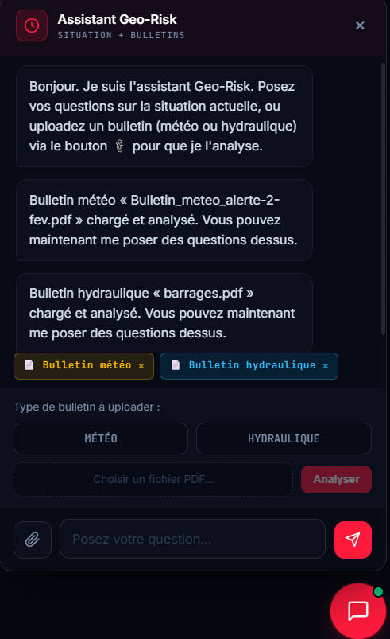
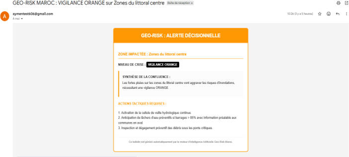
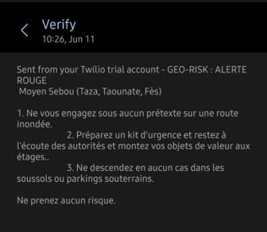
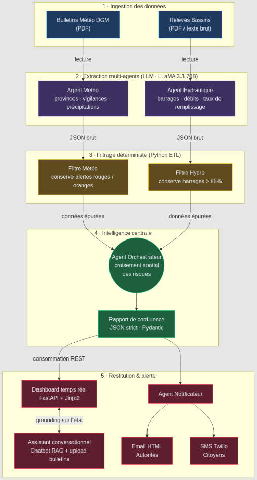
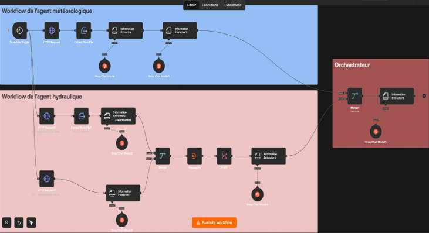

<div align="center">

# Geo-Risk Maroc

### Système Multi-Agents d'Aide à la Décision pour la Prévention des Crises Hydrométéorologiques

*Un moteur d'IA agentique qui ingère des bulletins bruts, croise les risques météo et hydrauliques, et déclenche des alertes ciblées — des autorités aux citoyens.*


</div>

---

## Guide rapide

- [Le problème](#-le-problème)
- [La solution](#-la-solution)
- [Aperçu](#-aperçu)
- [Architecture](#-architecture)
- [Fonctionnalités clés](#-fonctionnalités-clés)
- [Stack technique](#-stack-technique)
- [Installation](#-installation)
- [Utilisation](#-utilisation)
- [Structure du projet](#-structure-du-projet)
- [Perspectives](#-perspectives)

---

## Le problème

Au Maroc, les crues soudaines et les inondations comptent parmi les risques climatiques les plus meurtriers. En situation de pré-alerte, les données existent — mais elles sont **silotées, hétérogènes et non structurées** :

- La **DGM** émet des bulletins météo au format PDF complexe.
- Les **Agences de Bassins Hydrauliques** publient des relevés de barrages et de débits d'oueds dans d'autres formats.

En pleine urgence, le croisement **manuel** de ces sources pour identifier les *confluences de risques* — par exemple, de fortes pluies annoncées sur un bassin dont le barrage est déjà à 96 % — est lent et sujet à l'erreur humaine. Ce délai retarde la décision et la diffusion des consignes de sécurité.

## Solution proposée

**Geo-Risk Maroc** est un Outil d'Aide à la Décision (OAD) qui automatise toute cette chaîne grâce à une **architecture multi-agents hybride** : des LLMs pour l'analyse sémantique des documents, du code Python déterministe pour le filtrage et la fiabilité.

Le système transforme des bulletins bruts en un **rapport de confluence structuré**, l'affiche sur un **dashboard temps réel**, répond aux questions des opérateurs via un **assistant conversationnel**, et diffuse des **alertes ciblées** (email aux autorités, SMS aux citoyens).

## Apport de cette solution 
Concrètement, Geo-Risk Maroc permet de :
 
-  **Réduire drastiquement le temps de réaction** — le croisement des risques, aujourd'hui manuel et chronophage, devient instantané, ce qui accélère la prise de décision et contribue à **sauver des vies**.
-  **Décloisonner des données hétérogènes** — bulletins météo, relevés de barrages et débits d'oueds sont unifiés en une seule vision opérationnelle cohérente.
-  **Diffuser la bonne information à la bonne cible** — messages techniques structurés pour les autorités, consignes de sécurité claires et concises pour les citoyens.
-  **Maîtriser les coûts d'exploitation** — le filtrage déterministe en amont réduit la consommation de tokens LLM, rendant la solution économiquement viable à l'échelle.
-  **S'intégrer et évoluer facilement** — l'architecture modulaire et le format JSON standardisé permettent d'ajouter de nouvelles sources ou de brancher le moteur sur d'autres systèmes sans refonte.
-  **Garantir la fiabilité** — les schémas stricts et les recommandations figées réduit drastiquement les hallucinations, condition indispensable pour un outil de gestion de crise.
---

## Aperçu
> **Note :** le dashboard déployé est initialisé avec un **jeu de données de démonstration** (une situation de crise réaliste sur le bassin du Sebou) afin d'illustrer le système sans exécution du pipeline. Ces données sont automatiquement remplacées dès qu'un rapport réel est généré par le moteur.

### Dashboard — Salle de crise opérationnelle


### Assistant conversationnel (RAG sur la situation courante + upload de bulletins)


### Alertes multi-canal
|        Email aux autorités        |       SMS aux citoyens        |
|:---------------------------------:|:-----------------------------:|
|  |  |

---

## Architecture

Le système repose sur un **pipeline séquentiel** où code déterministe et intelligence générative collaborent :



**Pourquoi cette approche ?**

Un LLM seul est coûteux et imprécis. En intercalant des filtres Python déterministes entre les agents, le système reste **fiable, économe en tokens, et prévisible** — tout en gardant la puissance sémantique des modèles pour l'extraction et le raisonnement.

---
## Prototypage : PoC sous n8n

Avant l'implémentation en code, une première version a été prototypée avec **n8n** (outil d'automatisation no-code) pour valider rapidement la faisabilité du concept et tester la réceptivité des LLMs face aux bulletins marocains.



Ce prototype a démontré la valeur du concept, mais a révélé des **limites incompatibles avec une mise en production fiable** :

- **Gaspillage de tokens** — impossible d'insérer des filtres algorithmiques complexes pour alléger les requêtes LLM.
- **Formatage rigide** — garantir un JSON strict à chaque exécution s'est avéré difficile sans validation orientée objet.
- **Gestion d'erreurs limitée** — les retries et pauses (rate limiting) étaient laborieux à implémenter visuellement.

Ces constats ont motivé le passage à une **architecture logicielle sur-mesure en Python**, offrant un contrôle total sur le flux de données, le filtrage pré-IA et le typage strict — détaillée ci-dessous.
## Fonctionnalités clés

| Fonctionnalité | Description |
|---|---|
|  **Extraction multi-agents** | Agents spécialisés Météo et Hydro extraient les données structurées de PDF/textes bruts via LLM. |
|  **Filtrage déterministe (ETL)** | Règles Python strictes qui éliminent le bruit avant l'IA (barrages < 85 %, vigilances vertes) — réduction des coûts en tokens. |
|  **Orchestrateur de confluence** | Croise météo × hydraulique, calcule un niveau de crise unifié (Urgence Noire / Alerte Rouge / Vigilance Orange). |
| ️ **Anti-hallucination** | Schémas Pydantic stricts + recommandations figées (hardcodées) validées par la Protection Civile. |
|  **Dashboard temps réel** | Interface FastAPI/Jinja façon salle de crise : KPIs, infrastructures, cartes de zones, auto-refresh. |
|  **Assistant conversationnel** | Chatbot ancré sur la situation courante (grounding sur l'état, zéro hallucination), avec upload de bulletins météo/hydro à analyser. |
|  **Alertes multi-canal** | Emails HTML structurés aux autorités, SMS concis aux citoyens via Twilio. |
|  **Conteneurisé** | Image Docker prête au déploiement, secrets gérés par variables d'environnement. |

---

## Stack technique

**Cœur & IA**
- **Python 3.11** — langage principal
- **LangChain** — orchestration des agents et structuration des sorties
- **Groq API / LLaMA 3.3 70B** — modèle d'extraction et de raisonnement
- **Pydantic** — contrats de données stricts, validation anti-hallucination

**Web & interface**
- **FastAPI** — API REST + serveur du dashboard
- **Jinja2** — rendu dynamique du tableau de bord
- **HTML / CSS / JavaScript** — interface temps réel 

**Notification & extraction**
- **Twilio** — SMS d'alerte aux citoyens
- **smtplib** — emails HTML aux autorités
- **pdfplumber** — parsing des bulletins PDF

**Infra & outils**
- **Docker** — conteneurisation
- **Git** — contrôle de version (workflow feature-branch)
- **python-dotenv** — gestion sécurisée des secrets

---

## Installation

### Prérequis
- Python 3.11
- Un compte [Groq](https://console.groq.com) (clé API)
- (Optionnel) Un compte Twilio + un mot de passe d'application Gmail pour les notifications

### 1. Cloner le dépôt
```bash
git clone https://github.com/AymenMamaoui/geo-risk-engine.git
cd geo-risk-engine
```

### 2. Créer l'environnement virtuel
```bash
python -m venv myenvironement
# Windows
myenvironement\Scripts\activate
# Linux / macOS
source myenvironement/bin/activate
```

### 3. Installer les dépendances
```bash
pip install -r requirements.txt
```

### 4. Configurer les secrets
Crée un fichier `.env` à la racine (voir `.env.example`) :
```env
GROQ_API_KEY=ta_cle_groq

# Notifications (optionnel)
EMAIL_ADDRESS=ton_email@gmail.com
EMAIL_PASSWORD=ton_mot_de_passe_application
ALERT_EMAIL_TO=destinataire@gmail.com

TWILIO_ACCOUNT_SID=ton_sid
TWILIO_AUTH_TOKEN=ton_token
TWILIO_PHONE_NUMBER=+1xxxxxxxxxx
ALERT_SMS_TO=+212xxxxxxxxx
```


---

## Utilisation

### Lancer le dashboard (à démarrer en premier)
```bash
python dashboard_app.py
# → http://localhost:8000
```

### Lancer le moteur d'analyse (dans un second terminal)
```bash
python main.py
```
Le pipeline s'exécute, produit le rapport de confluence, met à jour le dashboard et déclenche les notifications.

### Via Docker
```bash
# Construire l'image
docker build -t geo-risk-dashboard .

# Lancer le conteneur (secrets injectés au runtime)
docker run -p 8000:8000 --env-file .env geo-risk-dashboard
```
### Données de démonstration

Au démarrage, le dashboard se peuple avec un rapport de démonstration (`demo_data.py`) pour afficher immédiatement une situation réaliste — utile en déploiement ou pour une première prise en main sans lancer le pipeline complet.

Ce comportement est contrôlé par une variable d'environnement :
```env
USE_DEMO_DATA=true   # démo active (défaut) · false pour démarrer avec un état vide
```

Dès qu'un rapport réel arrive via `POST /api/report` (lancement de `main.py`), il remplace automatiquement les données de démonstration.

---

## Structure du projet

```
geo-risk-engine/
├── agents/
│   ├── meteo_agent.py        # Extraction météo (LLM)
│   ├── hydro_agent.py        # Extraction hydraulique (LLM)
│   ├── orchestrator.py       # Croisement des risques (LLM)
│   ├── notifier_agent.py     # Alertes email + SMS
│   └── chat_agent.py         # Assistant conversationnel
├── core/
│   └── config.py             # Chargement des secrets (.env)
├── schemas/
│   └── data_models.py        # Contrats Pydantic
├── tools/
│   └── pdf_loader.py         # Parsing PDF / texte
├── templates/
│   └── dashboard.jinja       # Interface du dashboard
├── dashboard_app.py          # Serveur FastAPI (dashboard + chat + upload)
├── main.py                   # Point d'entrée du pipeline
├── Dockerfile                # Conteneurisation
├── requirements.txt
└── .env                      # Secrets (non versionné)
```

---

## Perspectives

Le moteur actuel est un **Proof of Concept fonctionnel**. Son architecture modulaire ouvre la voie à une industrialisation :

- **Ingestion continue** — remplacer la lecture statique de PDF par des connecteurs API temps réel (capteurs IoT des barrages, flux DGM).
- **Base documentaire (RAG complet)** — intégrer un vector store interrogeable (historique des bulletins, seuils réglementaires, protocoles), sous réserve d'accès aux données de la DGM.
- **Déploiement Cloud & CI/CD** — orchestration conteneurisée pour la haute disponibilité en cas de pic de trafic lors d'une crise.
- **Nouveaux agents** — un Agent Réseaux Sociaux (géolocalisation des appels à l'aide sur X) ou un Agent Logistique (routes d'évacuation via Google Maps/Waze).

---

## Retours & contributions

Ce projet est en évolution constante. Vos remarques, suggestions et retours d'expérience sont les bienvenus — n'hésitez pas à ouvrir une [issue](https://github.com/AymenMamaoui/geo-risk-engine/issues) ou à me contacter directement. Toute contribution ou piste d'amélioration sera appréciée.

Me contacter : [LinkedIn](https://www.linkedin.com/in/aymen-mamaoui-527a343a8/)

---
<div align="center">

**Réalisé par [Aymen Mamaoui](https://github.com/AymenMamaoui)**

</div>